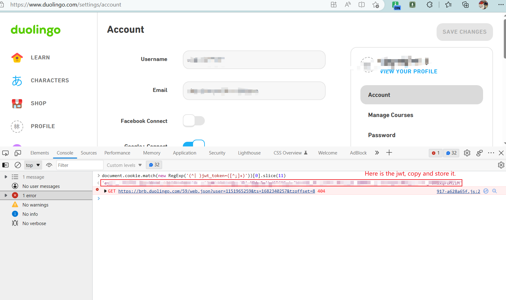
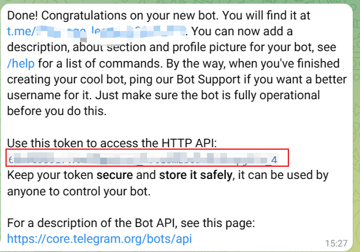
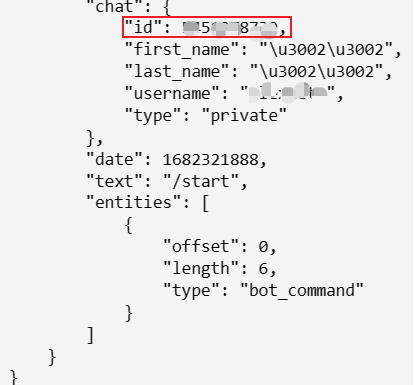
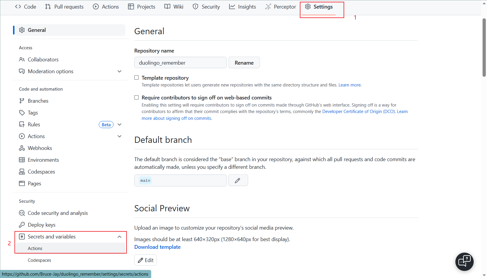
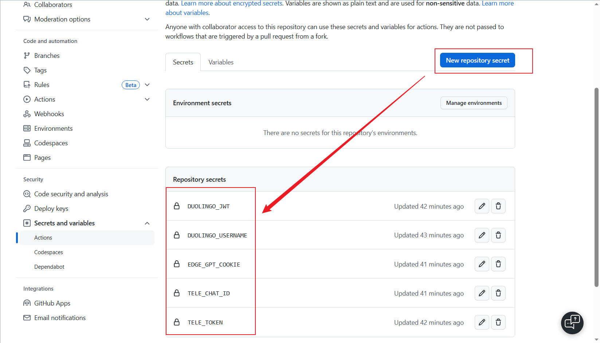

# duolingo_remember
Automatically send new words from duolingo to telegram

https://user-images.githubusercontent.com/15976103/233841350-08bf3a61-3447-409d-9e04-22739f9691dd.mp4

## steps

Here is the steps for bing-autogenerate method. If you use api by openAPI, just change it in github secrets.

Login duolingo.com to get jwt, open webbrowser, press F12 to call devtools, run `document.cookie.match(new RegExp('(^| )jwt_token=([^;]+)'))[0].slice(11)`

If you are a Chinese Mainland user who registers duolingo with your phone, you may not log in PC-end duolingo.com to get your jwt. In this case, please create a new account with your email, set the password and log in.



Get your telegram token and chatid (please google how to)

For this step, you should first create a telegram bot, refer to this: [From BotFather to 'Hello World' (telegram.org)](https://core.telegram.org/bots/tutorial)

The time when you successfully set username for your tg bot, a token will be generated, please store it.



You should also get your own chatid (not the bot). You should have a tg username, and you can search @RawDataBot in telegram to get your chatid.



Change the secrets to your own, you should first fork it, and find Settings->Secrets and variables->Actions



click “New repository secret” to add new secrets. The name of secrets should be the same to those in your yml.

Get your cookie by visiting www.bing.com, and www.cn.bing.com is also ok. You can install plugin “Cookie-Editor” first, and when visiting the page, use the plugin to generate cookies. This should be the value for “EDGE_GPT_COOKIE”. (If using openai api key, change the name and its value.)



Change your own config file in [yml](./.github/workflows/run_duolingo.yml)

If you fork this repo run the actions, please trigger the action first (by mannual).

After triggering the action, you can run your overflow. If succeeded, your bot will send you a message.


## Run local

```
pip install -r requirements.txt
python duolingo.py ${duolingo_name} ${duolingo_jwt}
```


## TODO
- [ ] Support auto buy streak freeze
- [x] Support sentence mp3
- [x] Make action a little simple
- [ ] Support Multi lauguages
- [ ] Support send to other bots like dingding


# Contribution

- Any issues or PRs are welcome.
- Please run `black .` before submitting the code.

## Appreciation

Thank you, that's enough.
